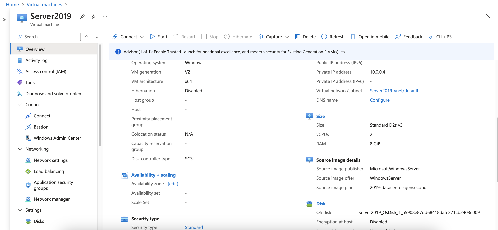
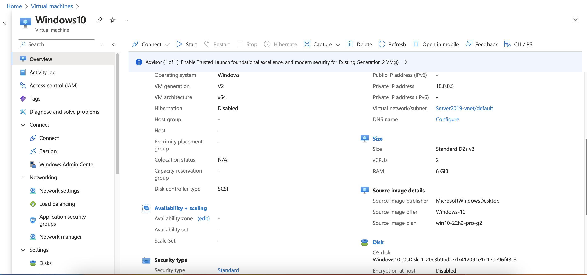
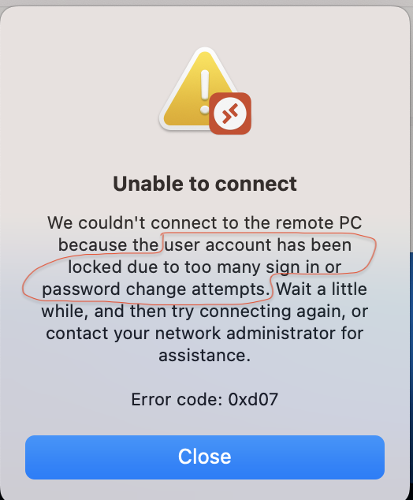
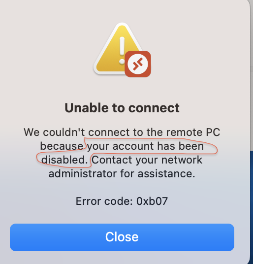
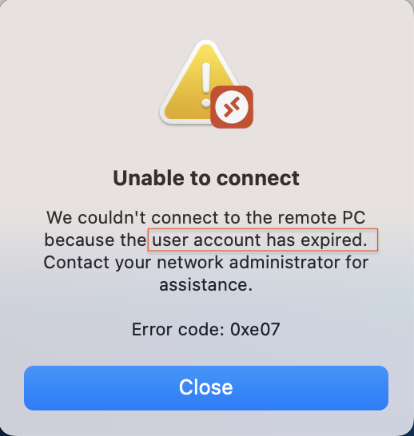
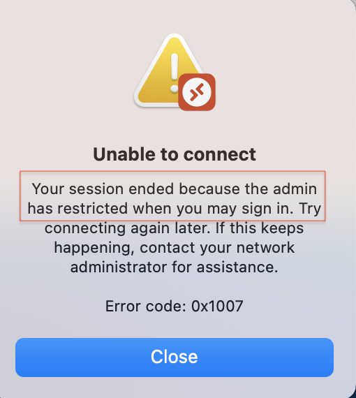

## Active Directory (AD) Overview

Active Directory (AD) is a directory service used to manage and organize users and computers within a Windows network. It provides centralized authentication, authorization, and administration, enabling administrators to enforce policies and manage access efficiently.

## Project Details

- **Domain Controller Setup**: Created a Windows Server 2019 virtual machine in Microsoft Azure to act as the Domain Controller. Installed the necessary components for Active Directory Domain Services (ADDS).

  

- **Domain Creation**: Set up a domain named `BikashTech.local`.

- **User Creation**: Used PowerShell to create a new user. Imported the Active Directory module with `Import-Module ActiveDirectory`, then created the user with `New-ADUser -Name "John"`.

- **Policy Assignment**: Configured various policies for John, including account lockout and logon hours.

- **Additional Machine**: Created another Windows 10 virtual machine in Azure and joined it to the `BikashTech.local` domain. Verified domain connection by successfully pinging the domain.

## Testing Scenarios

- **Account Lockout**: Set a policy to lock the account after three failed login attempts. After entering the wrong password three times, the account was locked. I used the "Unlock account" option from the Domain Controller, and John was able to log in again.

- **Account Disable**: Disabled John’s account, preventing login. Re-enabled the account from the Domain Controller, allowing John to log in successfully.

  
 

- **Account Expired**: Set John’s account to expire, which prevented login. Re-enabled the account from the Domain Controller, allowing John to log in successfully.

  

- **Logon Hours**: Set a policy to restrict login hours from 9 AM to 5 PM. John was unable to log in at 7 PM due to this restriction.

  
